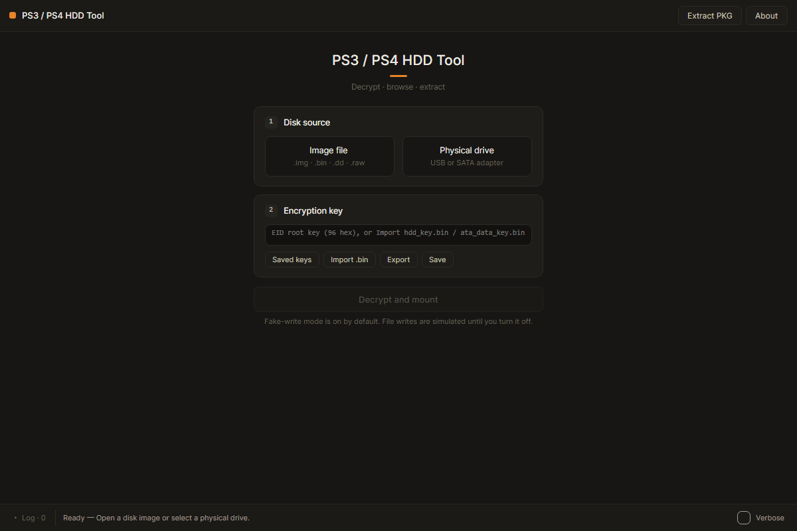
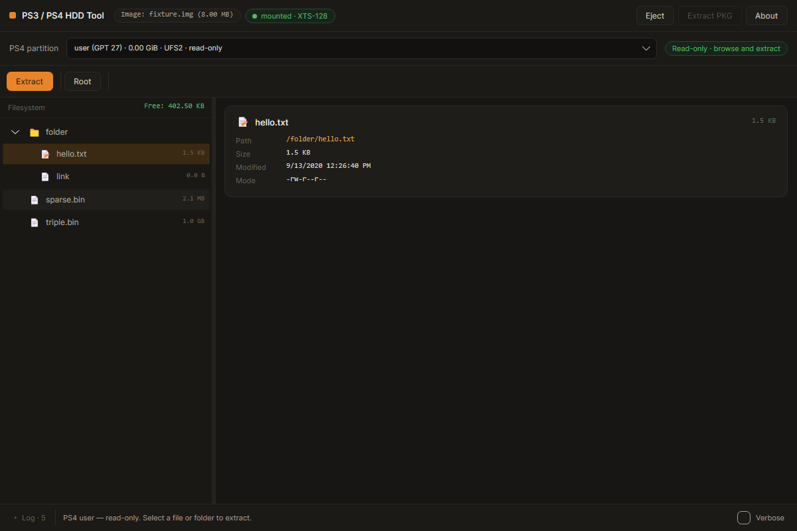
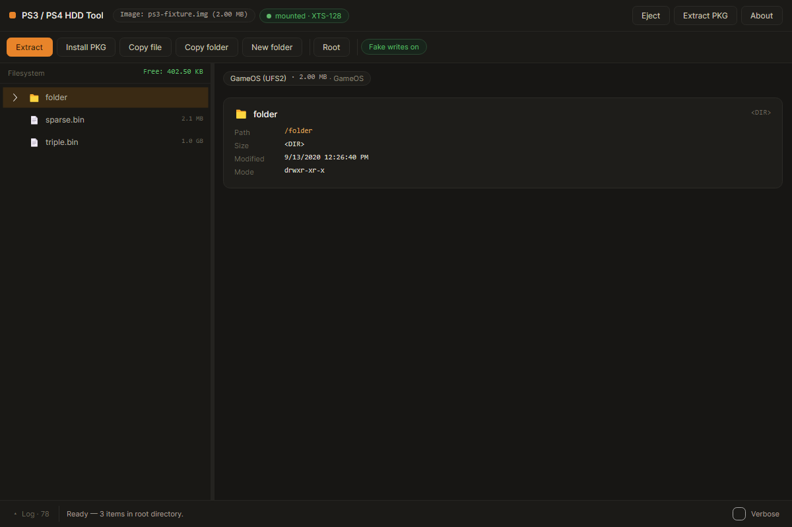

# PS3 / PS4 HDD Tool

A .NET 10 and Avalonia application for browsing console hard drives and raw disk images on Windows, Linux, and macOS.

## Screenshots

Captured from the application using synthetic test images.

**Guided setup** — choose an image or physical drive, import its key, and mount the filesystem.



**PS4 read-only browser** — select a partition, browse folders, inspect file details, and extract files to your computer.



**PS3 browser** — browse and extract files, with the existing PS3 write tools and fake-write toggle available.



## Supported disks

| Source | Keys | Available operations |
| --- | --- | --- |
| PS3 NAND | EID Root Key or pre-derived CBC-192 ATA key | Browse, extract, and existing PS3 write operations |
| PS3 NOR / Slim | EID Root Key or pre-derived XTS-128 ATA keys | Browse, extract, and existing PS3 write operations |
| PS4 internal HDD / full raw disk image | 32-byte EAP HDD key | Read-only browsing and extraction of `user` and `eap_user` |

Images can use `.img`, `.bin`, `.dd`, or `.raw` extensions. These are raw sector images, not compressed or virtual-disk containers. Physical disk access may require administrator/root privileges. The reader requires 512-byte logical sectors.

## PS4: browse and extract

1. Choose **Image file** or **Physical drive** on the setup screen. A full PS4 disk is recognized from its GPT partition table.
2. Click **Import .bin** and select your console's 32-byte `keys.bin` or `eap_hdd_key.bin`. You can also enter 64 hexadecimal characters directly. Obtain the key separately; this application does not dump it from the console.
3. Select **user** or **eap_user** in **PS4 partition**, then click **Mount Partition**.
4. Expand folders, select a file or directory, and click **Extract** to save it to your computer.
5. To switch partitions, choose another partition and click **Mount Partition** again.

Key byte order and XTS IV mode are detected automatically: the reader tries the supplied key and reversal within each 16-byte half, with either zero IV offset or `(GPT slot - 1) << 32`. Each candidate must yield valid little-endian UFS2 geometry and a valid root directory. Disk offsets and partition-relative XTS sector numbers are handled separately.

PS4 sources are opened read-only. The partition reader rejects every write operation, and PS3 write/PKG installation actions are unavailable. PS4 keys are not added to the PS3 key/profile database or written into activity logs.

Current limits:

- Full internal-HDD images with an intact primary GPT are supported; standalone partition images and backup-GPT recovery are not implemented.
- `update` and `eap_vsh` are shown but require a FAT reader. Other encrypted partitions require different keys or formats and cannot be mounted by this feature.
- USB extended storage, PS4 PKG processing, writes, and deleted-file recovery are not included.
- Extraction handles regular files and directories, including sparse files and single/double/triple indirect blocks. Source symbolic links and special files are skipped during folder extraction.
- Names that cannot be represented safely on the destination platform produce an error. Extraction does not follow existing destination symbolic links. Existing regular destination files are overwritten.

References: [PS4 mounting guide](https://www.psdevwiki.com/ps4/Mounting_HDD_in_Linux), [PS4 partition types](https://www.psdevwiki.com/ps4/Partitions), [UFS structures](https://github.com/torvalds/linux/blob/master/fs/ufs/ufs_fs.h).

## PS3 usage

Open a disk, import its EID Root Key or pre-derived HDD keys, and click **Decrypt and mount**. The EID Root Key is 48 bytes: a 32-byte AES key and 16-byte IV. Pre-derived XTS keys contain 16-byte data and tweak halves; CBC imports use the existing 48-byte combined format. The key importer also accepts separate data/tweak files.

The existing PS3 features include UFS2 browsing, extraction, image previews, saved keys and drive profiles, file/folder writes, directory creation, rename/delete, and PS3 PKG extraction/installation. **Fake writes on** is enabled by default. Image files currently open read-only; actual PS3 writes use writable physical disks.

The Workbench interface uses a charcoal/orange theme, guided setup, a resizable file browser, and a collapsible **Log**. Right-click files for extraction, copy path, and (PS3 only) rename/delete. **Eject** returns to setup; the five most recent sources are remembered for reopening. Recent-source storage contains paths and sizes, not encryption keys.

## Build and run

Install the [.NET 10 SDK](https://dotnet.microsoft.com/download/dotnet/10.0), then:

```sh
dotnet restore PS3HddTool.sln
dotnet build PS3HddTool.sln
dotnet run --project PS3HddTool.Avalonia
```

To publish a self-contained Windows executable:

```sh
dotnet publish PS3HddTool.Avalonia -c Release -r win-x64 --self-contained
```

Other runtime targets include `linux-x64`, `osx-x64`, and `osx-arm64`.

## Verification

The executable test project returns a nonzero exit code on failure:

```sh
dotnet run --project PS3HddTool.Tests
```

It covers GPT validation and slot numbering, XTS/key/IV combinations, partition bounds, write rejection, both UFS2 byte orders, sparse and indirect extraction, PS3 crypto compatibility, mount lifecycle, and headless window bindings. Generated fixtures and rendered window previews go under ignored `artifacts/ps4-tests/` directories.

Optional real-image verification (opens the source read-only):

```sh
dotnet run --project PS3HddTool.Tests -- "ps4hdd/User.img" "ps4hdd/keys.bin"
```

This browses both supported partitions and extracts up to two files of at most 32 MiB per partition. Extracted hashes are compared with an independent block-by-block reader. Source length and modification time are checked afterward. Real images and keys are not bundled with tests.

## Project structure

- `PS3HddTool.Core`: disk I/O, PS3 crypto, PS4 GPT/mounting, UFS2 reads/writes, PS3 PKG support.
- `PS3HddTool.Avalonia`: UI, disk lifecycle, partition selection, browsing and extraction.
- `PS3HddTool.Tests`: synthetic regression tests and optional real-image checks.
- `docs/PS3_UFS2_Filesystem_Reference_Final.md`: existing PS3 filesystem reference.

## License

See [LICENSE.md](LICENSE.md).
